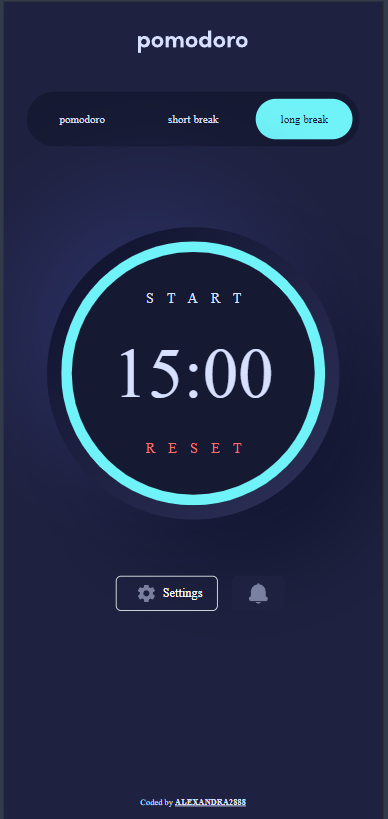
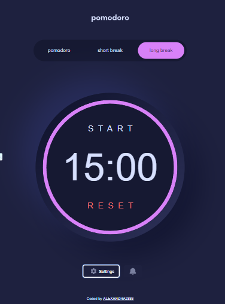

## Pomodoro App 🍅⏲️

Welcome to the Pomodoro App! This app is designed to help you stay productive by implementing the Pomodoro Technique. Customize your experience with different fonts, colors, and sounds to make your work sessions more enjoyable.






## Features ✨

⏲️ Pomodoro Timer: Set work and break intervals to boost productivity.
🎨 Customization: Change fonts and colors to suit your preference.
🔊 Sound Alerts: Add different sounds to notify you when the timer ends.


## Getting Started 🚀

Follow these instructions to get the project up and running on your local machine.

## Prerequisites 📋

Make sure you have the following installed:

Node.js
npm or yarn
Installation 💾
Clone the repository:

```
git clone git@github.com:Alexandra2888/pomodoro.git
cd pomodoro-app
```

Install dependencies:

Using npm:

```
npm install
```
Using yarn:

```
yarn install
```

## Running the App ▶️

To start the development server, run:

```
npm run dev
```
Or if you are using yarn:

```
yarn dev
```
Open your browser and navigate to http://localhost:3000 to see the app in action.

## Building for Production 📦

To create a production build, run:

```
npm run build
```
Or if you are using yarn:

```
yarn build
```
To start the production server, run:

```
npm start
```
Or if you are using yarn:

```
yarn start
```

## Scripts 📜

dev: Start the development server.
build: Create a production build.
start: Start the production server.
lint: Run ESLint to lint your code.

## Dependencies 📦


framer-motion
lucide-react
next
react
react-countdown-circle-timer
react-dom
react-hook-form
tailwind-merge
tailwindcss-animate
use-sound
zod

## Dev Dependencies 🛠️

@types/node
@types/react
@types/react-dom
eslint
eslint-config-next
postcss
tailwindcss
typescript

## Live 📹

https://pomodoro-crl7.vercel.app/


Enjoy using the Pomodoro App and stay productive! 🍅⏲️
